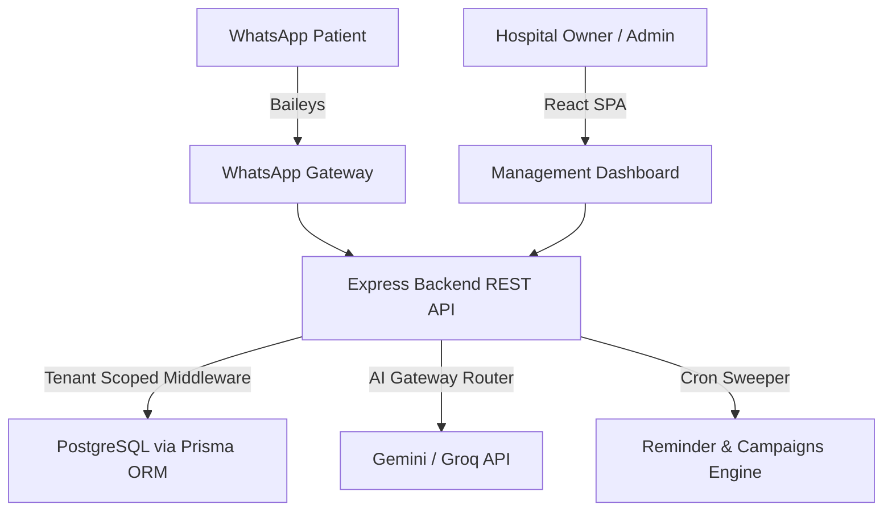

# Vardan Hospital AI SaaS Platform — Product Manuals & Guides

Welcome to the production documentation suite for the Vardan Hospital AI SaaS Platform. This guide is organized into modular sections for administrators, developers, and DevOps engineers.

---

## Table of Contents
1. [Architecture Overview](#1-architecture-overview)
2. [Installation & Developer Guide](#2-installation--developer-guide)
3. [Configuration & Environment Variable Guide](#3-configuration--environment-variable-guide)
4. [API Reference & Endpoint Documentation](#4-api-reference--endpoint-documentation)
5. [DevOps & Deployment Guide](#5-devops--deployment-guide)
6. [Backup, Restore & Security Guide](#6-backup-restore--security-guide)
7. [Troubleshooting & Admin Guide](#7-troubleshooting--admin-guide)

---

## 1. Architecture Overview

Vardan is a white-label, multi-tenant SaaS platform built to automate hospital scheduling, registration, triage, and patient follow-ups using a hybrid AI Gateway.



### High-Level Layers
- **Multi-Tenant Router**: Enforces database query boundaries based on subdomain mapping or host headers, preventing cross-tenant reads or writes.
- **Multimodal AI Engine**: Coordinates Gemini Vision OCR, voice-to-text transcriptions, and PDF parsers to extract prescription data and test report values.
- **WhatsApp Broker**: Manages independent Baileys socket sessions and QR authentication directories for each hospital client.
- **Reminder Engine**: Cron-powered task queue to deliver scheduled consultation follow-ups and broadcast campaigns with randomized throttle delays.

---

## 2. Installation & Developer Guide

### Prerequisites
- Node.js (v20 or higher)
- PostgreSQL (v14 or higher)
- Git

### Initial Setup
1. Clone the repository and navigate to the project directory:
   ```bash
   cd VARDAN.V2
   ```
2. Install packages across workspaces:
   ```bash
   npm install --legacy-peer-deps
   ```
3. Set up the local environment variables in `backend/.env` (refer to [Section 3](#3-configuration--environment-variable-guide)).
4. Run Prisma database migrations and seed default data:
   ```bash
   npm run prisma:migrate --workspace=backend
   ```
5. Build project packages:
   ```bash
   npm run build --workspace=backend
   npm run build --workspace=frontend
   ```

### Start Development Server
- To run the backend and frontend concurrently in development mode:
   ```bash
   npm run dev
   ```

---

## 3. Configuration & Environment Variable Guide

Create a `.env` file inside the `backend` workspace. Use the reference variables detailed below:

| Environment Variable | Required | Default | Purpose |
|---|---|---|---|
| `PORT` | Yes | `5000` | Port the Node Express backend listens on. |
| `NODE_ENV` | Yes | `development` | System running mode (`development` or `production`). |
| `DATABASE_URL` | Yes | — | Connection URL for PostgreSQL instance. |
| `JWT_SECRET` | Yes | — | Hashing signature key for JWT token sessions. |
| `ALLOWED_ORIGINS` | Yes | `*` | Comma-separated allowlist of origins for CORS. |
| `GEMINI_API_KEY` | Yes | — | Primary AI Gateway key for Gemini Flash APIs. |
| `GROQ_API_KEY` | Yes | — | Fallback AI Gateway key for Groq APIs. |
| `GOOGLE_APPS_SCRIPT_URL` | No | — | Endpoint URL to synchronize schedules to Google Sheets. |

---

## 4. API Reference & Endpoint Documentation

Every REST API request must specify a valid JWT inside the `Authorization: Bearer <TOKEN>` header. Multi-tenant context resolves automatically based on host domain names or custom `x-tenant-id` headers.

### Public Directory & SaaS Onboarding
- **`POST /api/v1/tenant/onboard`**
  - Registers a new hospital tenant, owner account, default role settings, and theme colors.
  - *Payload*:
    ```json
    {
      "hospitalName": "City Hospital",
      "slug": "cityhosp",
      "adminEmail": "admin@cityhosp.com",
      "adminPassword": "securepassword",
      "branding": {
        "primaryColor": "#3b82f6",
        "secondaryColor": "#1e293b",
        "theme": "dark"
      }
    }
    ```

- **`GET /api/v1/tenant/branding`**
  - Resolves colors and layout configurations based on host domain names.

### Appointments & Registrations
- **`POST /api/v1/appointments/book`**
  - Registers a consultation slot. Prevents double-booking.
  - *Payload*: `{ "patientId": "P-123", "doctorId": "D-456", "date": "2026-07-20T10:00:00Z", "reason": "Fever" }`

- **`POST /api/v1/appointments/cancel`**
  - Cancels a scheduled booking.
  - *Payload*: `{ "appointmentId": "A-789" }`

- **`GET /api/v1/appointments`**
  - Retrieves a list of active appointments for the tenant.

### Multimodal Processing
- **`POST /api/v1/ocr/process`**
  - Uploads a document or prescription image for OCR.
  - *Payload*: Multipart form upload with field `file`.

- **`POST /api/v1/voice/transcribe`**
  - Uploads an audio message for speech-to-text.
  - *Payload*: Multipart form upload with field `file`.

- **`POST /api/v1/pdf/analyze`**
  - Parses text parameters from a PDF and returns a summary.
  - *Payload*: Multipart form upload with field `file`.

### Operations Analytics
- **`GET /api/v1/analytics/dashboard`**
  - Operational widgets aggregates and AI-generated insights based on actual statistics.

- **`GET /api/v1/analytics/export?type=patients`**
  - Generates and returns a secure CSV report. Logged in `AuditLog` for security.

---

## 5. DevOps & Deployment Guide

### Running via Docker Compose (Recommended)
1. Provide API keys for Gemini/Groq inside your shell environment:
   ```bash
   export GEMINI_API_KEY="your-api-key"
   ```
2. Build and boot the container cluster:
   ```bash
   docker-compose up -d --build
   ```
3. Nginx listens on port `80` reverse-proxying requests to the backend service running on port `5000`.

### Running via PM2 (Bare Metal/VPS)
1. Compile backend code: `npm run build --workspace=backend`
2. Launch the backend process cluster:
   ```bash
   pm2 start ecosystem.config.cjs
   ```

---

## 6. Backup, Restore & Security Guide

### Automated Backups Script
To run manual or cron database snapshots:
```bash
# Export the database schema and values
pg_dump -U postgres -d hospital_saas -F c -b -v -f "/backups/db_$(date +%F).backup"
```

### Recovery Procedure
To restore the PostgreSQL database from a binary dump file:
```bash
pg_restore -U postgres -d hospital_saas -v "/backups/db_2026-07-16.backup"
```

### Security Hardening
- **Data Isolation**: `tenantResolver` resolves headers and subdomains on incoming traffic and asserts match against JWT claims before permitting reads or writes.
- **Input Sanitization**: Rejects non-allowed mime types (max size 25 MB) inside multer configuration and secures HTTP headers using Helmet.

---

## 7. Troubleshooting & Admin Guide

### Unreachable Database Server
- Ensure PostgreSQL is active on port `5432` and check your credentials string in the `DATABASE_URL`.
- Verify docker-compose has completed database migrations.

### WhatsApp Connection Failure
- Verify the container has write permissions to store QR session files inside the `sessions/` directory.
- Check Baileys connection state log: `pm2 logs` or `docker logs hospital-backend`.
